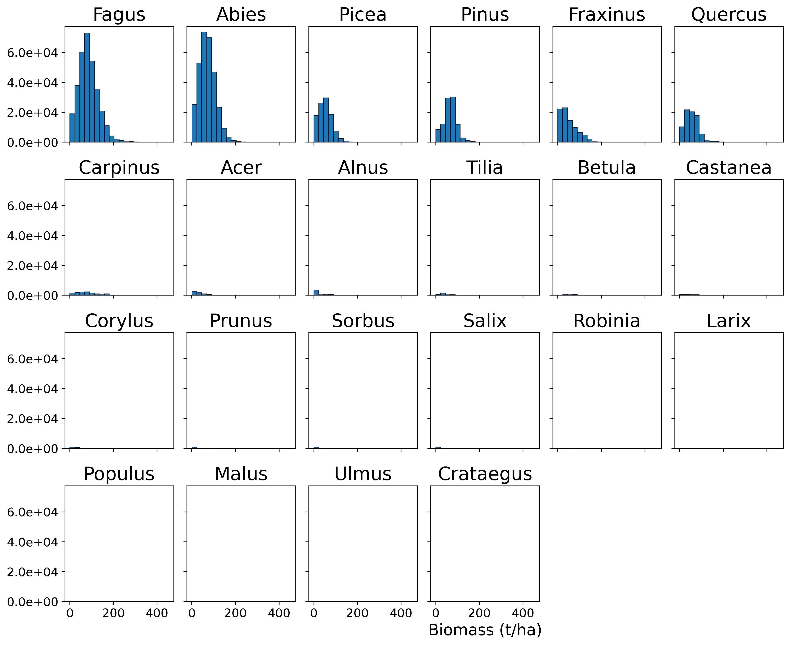
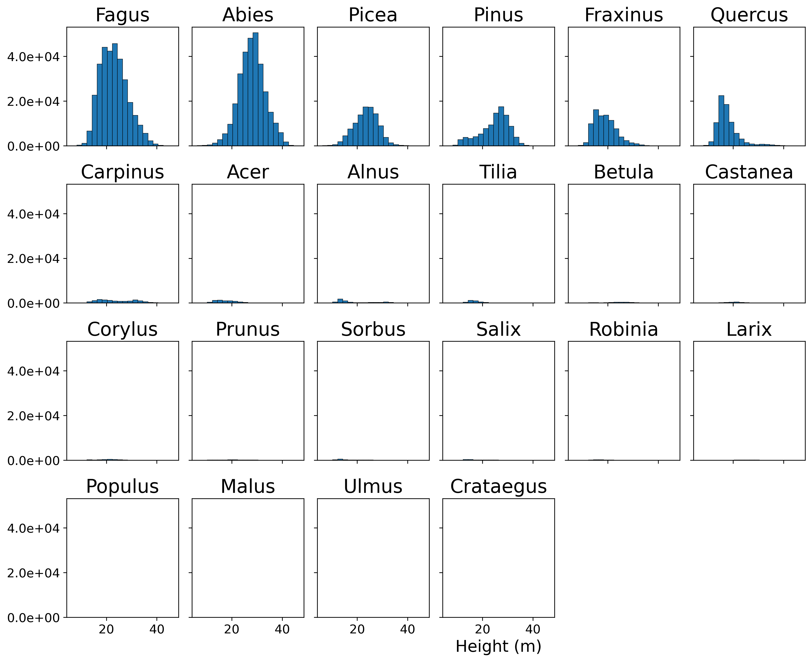
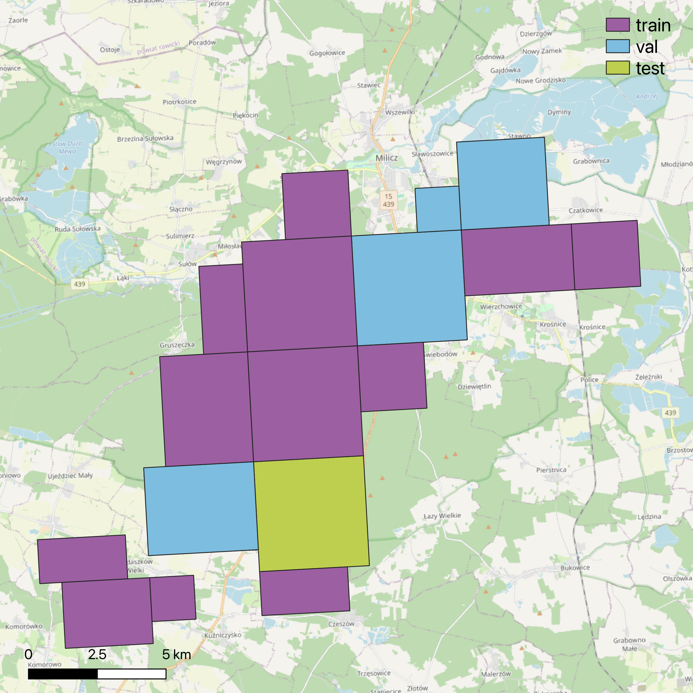
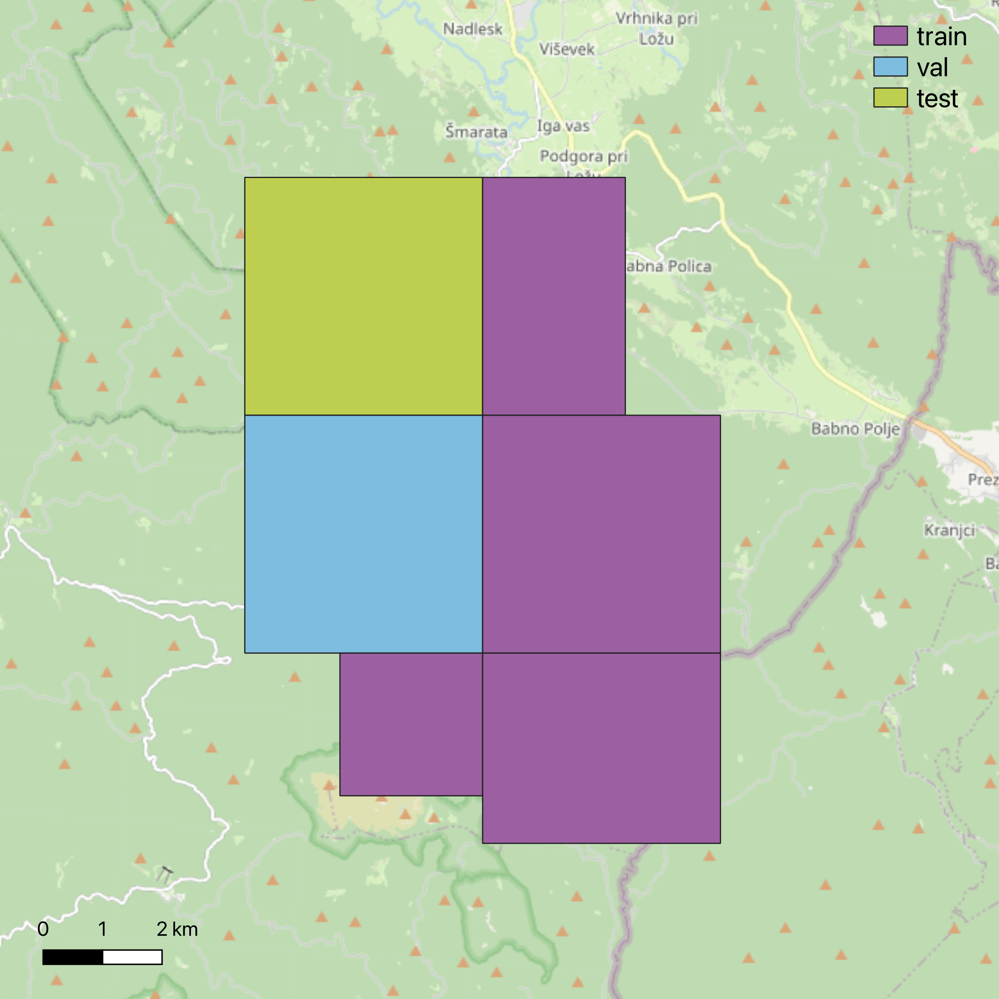
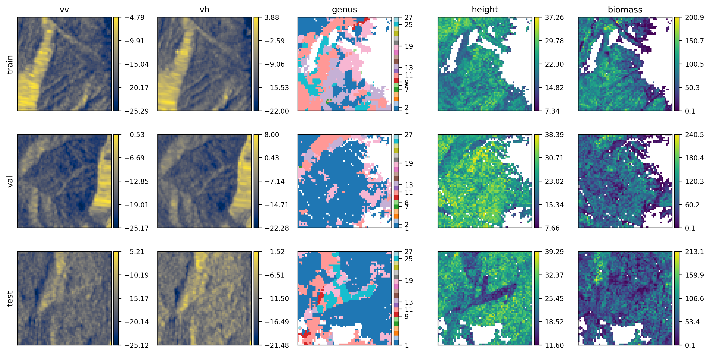
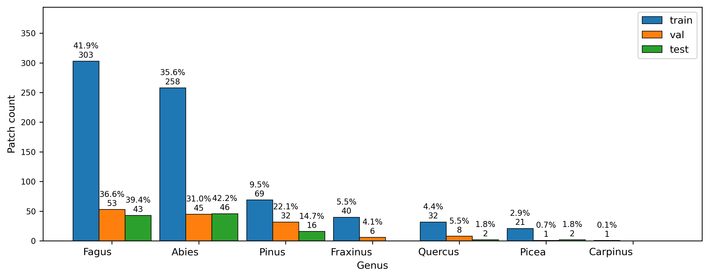
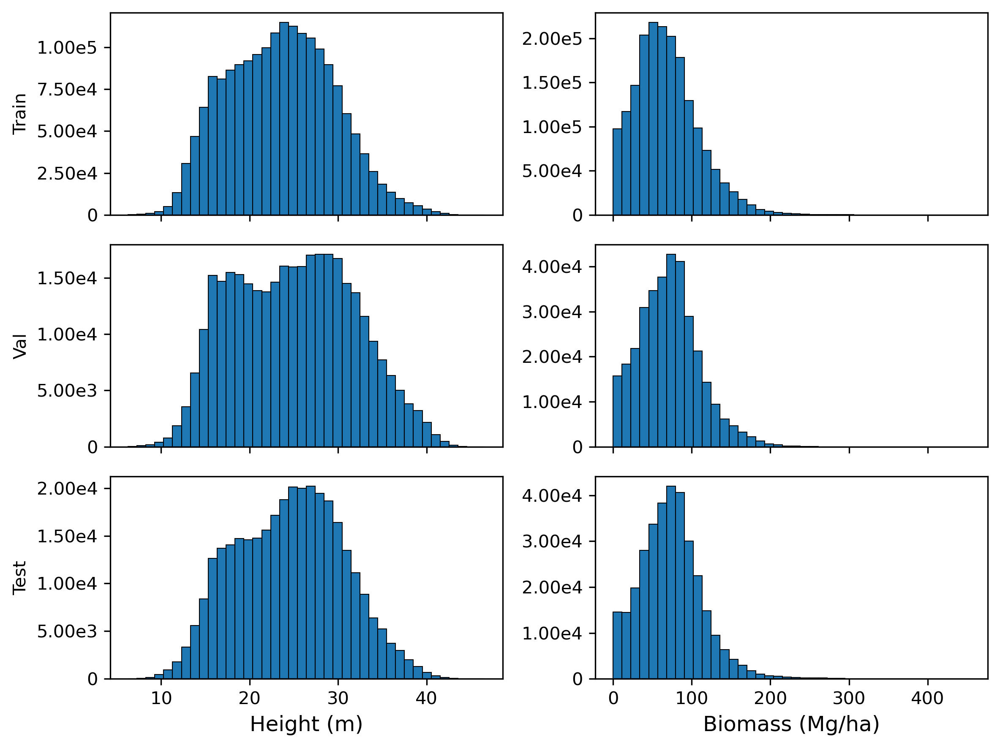

# Data Preprocessing Pipeline

Transforms raw I-MAESTRO tree inventory data and Sentinel-1 SAR imagery into training-ready patches for multi-task forest attribute estimation.

## Data Sources

### I-MAESTRO Synthetic Forest Dataset

Three European forest landscapes with tree-level inventory data:

| Site | Location | CRS | Trees | Grid Cells | Forest Area |
|------|----------|-----|-------|------------|-------------|
| **Bauges** | France (Geopark) | EPSG:2154 | 10.5M | 2.8M | 45,000 ha |
| **Milicz** | Poland (Forest District) | EPSG:2180 | 4.6M | 795K | 20,000 ha |
| **Sneznik** | Slovenia (Forest) | EPSG:3912 | 0.8M | 211K | 5,300 ha |

**Tree attributes:** Species, DBH (cm), height (m), count per cell  
**Spatial resolution:** 25m grid (0.0625 ha per cell)  
**Total coverage:** >100,000 ha with 42M+ trees from 51 species

### Sentinel-1 SAR Data

**Source:** Alaska Satellite Facility (ASF) - https://search.asf.alaska.edu/  
**Product type:** Ground Range Detected (GRD)  
**Acquisition mode:** Interferometric Wide (IW) swath  
**Polarization:** Dual-pol (VV + VH)  
**Wavelength:** C-band (5.405 GHz)  
**Temporal coverage:** 2019 growing season

## Processing Pipeline

### Stage 1: I-MAESTRO Structural Data Processing

**Biomass estimation** using species-specific allometric equations:
```
Biomass (kg) = a × DBH^b × wood_density
```
- 52 species with calibrated parameters (a, b, wood_density)
- Wood density range: 0.35-0.90 g/cm³ across species
- Aggregated to cell level and converted to t/ha

**Height statistics** computed as 95th percentile (height95) - robust metric for canopy top height less sensitive to outliers.

**Genus classification** extracted from species names, reducing 51 species to 31 genus-level categories. Dominant genus per cell determined by tree count.

**Spatial smoothing** applied to reduce noise:
- Edge-preserving filter for continuous variables (biomass, height)
- Majority filter for categorical data (genus)
- Only valid pixels modified, preserving forest mask

<div style="display: flex; gap: 10px; justify-content: space-between;">


</div>
*Distribution of biomass (left) and height (right) by genus. Fagus and Abies dominate with distinct structural characteristics.*

### Stage 2: Sentinel-1 SAR Processing

**Radiometric calibration** converts digital numbers to sigma nought (σ⁰) backscatter coefficients.

**Terrain correction** using Range-Doppler orthorectification with SRTM 1-arcsec DEM, correcting topographic distortions critical for mountainous sites.

**Resampling to 25m grid** using bilinear interpolation ensures perfect alignment with structural layers.

**Backscatter conversion** to decibels (dB):
```
σ_dB = 10 × log10(σ_linear)
```

**Output:** VV and VH backscatter rasters aligned to I-MAESTRO grid in site-specific CRS.

### Stage 3: Training Patch Generation

**Multi-channel stacking** combines 5 layers in fixed order:
1. VH backscatter (dB)
2. VV backscatter (dB)  
3. Biomass (t/ha)
4. Dominant genus (numerical code)
5. Height95 (m)

**Spatial blocking strategy** prevents data leakage:
- Blocks of 4×4 patches (128×128 pixels = 3.2×3.2 km)
- Entire blocks assigned to train/val/test splits
- Ensures geographic separation between splits

<div style="display: flex; gap: 10px; justify-content: space-between;">



</div>
*Spatial distribution of train (purple), validation (blue), and test (green) blocks across the three sites.*

**Patch extraction:**
- Patch size: 64×64 pixels (1.6×1.6 km)
- Stride: 32 pixels (50% overlap within blocks)
- Quality filter: ≥20% valid pixels required

**Data splits:**
- Training: 724 patches (75%)
- Validation: 145 patches (15%)
- Test: 109 patches (10%)


*Example patches showing all five channels across train/val/test splits. SAR channels display speckle patterns, while structural layers show spatial clustering.*

## Data Distribution Analysis

### Genus Balance


*Patch counts by dominant genus across splits. Fagus (beech) most abundant with 300+ training patches, followed by Abies and Pinus.*

### Target Variable Distributions


*Pixel-level distributions show right-skewed patterns typical of forest data. Biomass ranges 0-400 t/ha, height 10-45m. Similar distributions across splits confirm balanced splitting.*

## Output Files

### Training Data
```
patches_{split}.npy          # Shape: (N, 5, 64, 64) - multi-channel patches
labels_dominant_genus_{split}.npy  # Shape: (N,) - genus codes
sites_{split}.npy            # Shape: (N,) - site names
```

### Metadata
- GeoJSON files with block geometries and split assignments
- Summary statistics per site and genus
- Quality control plots

## Scripts

- `raw_to_structural_data.py` - Process I-MAESTRO tree data to rasters
- `sentinel1_preprocessing.py` - SAR calibration and terrain correction
- `build_training_patches.py` - Patch extraction with spatial blocking
- `visualization.py` - Generate data exploration plots
- `main.py` - Run complete pipeline

## Usage

```bash
python main.py --sites bauges milicz sneznik --patch-size 64 --stride 32
```

## Key Design Decisions

✅ **Species-specific allometry** - Accurate biomass using calibrated wood density values  
✅ **Edge-preserving smoothing** - Reduces noise while maintaining spatial structure  
✅ **Spatial blocking** - Prevents autocorrelation-inflated performance estimates  
✅ **Perfect alignment** - Ensures pixel-to-pixel correspondence between SAR and targets  
✅ **Quality filtering** - Excludes patches dominated by NoData or non-forest areas