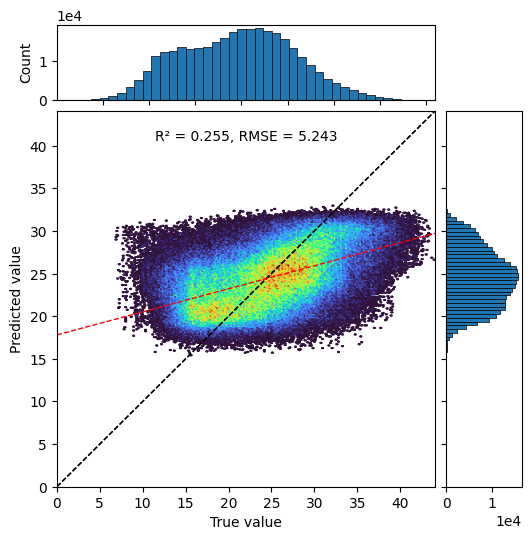
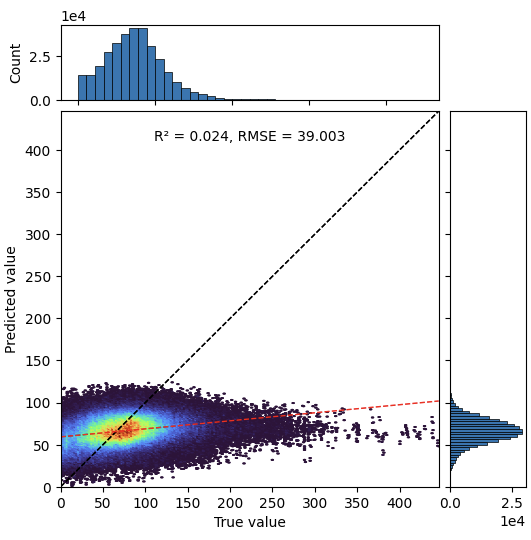
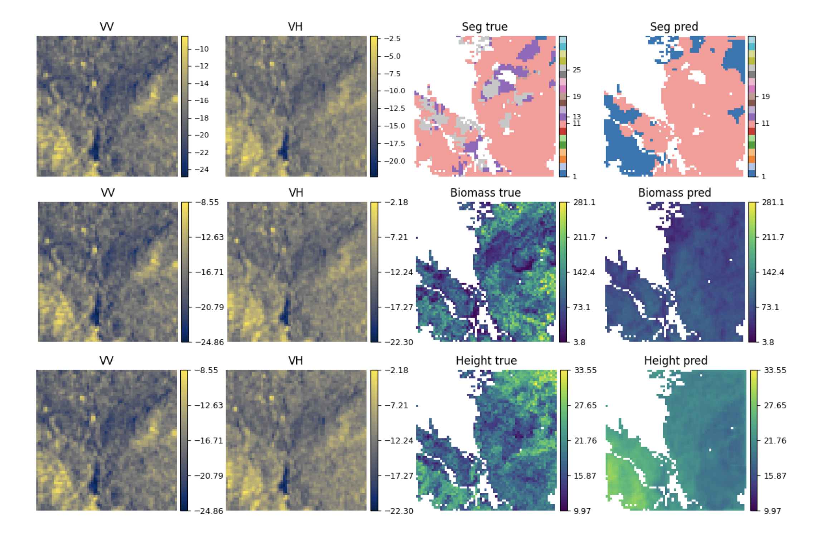
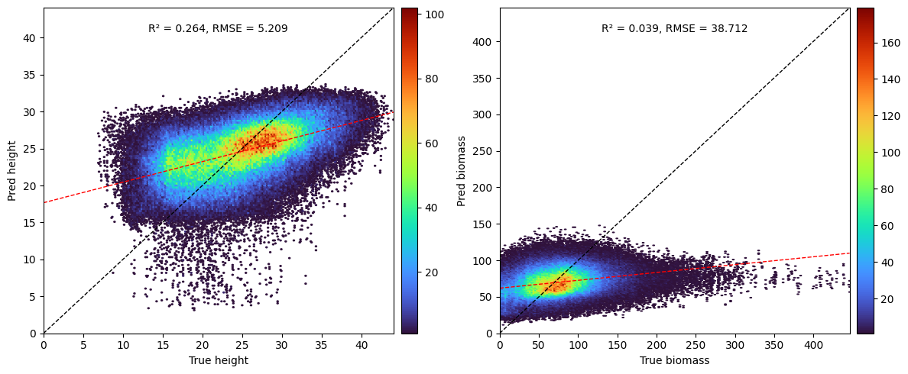
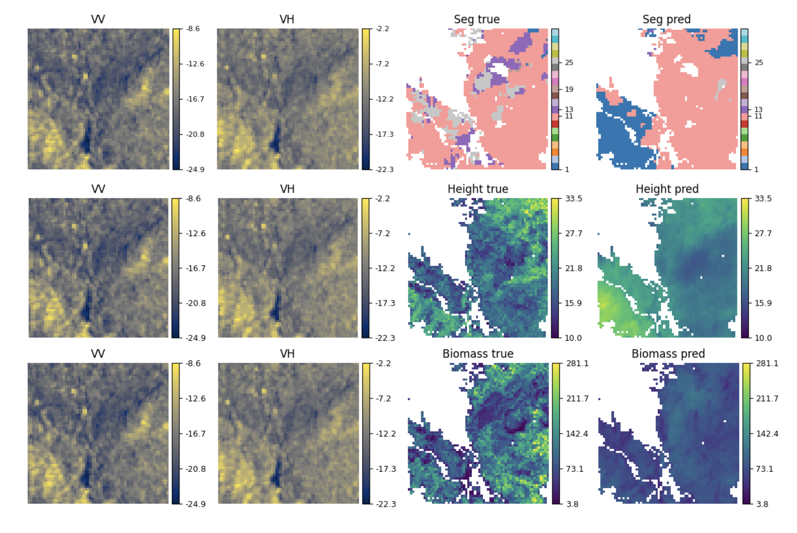
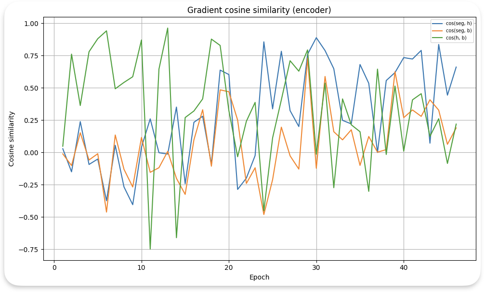
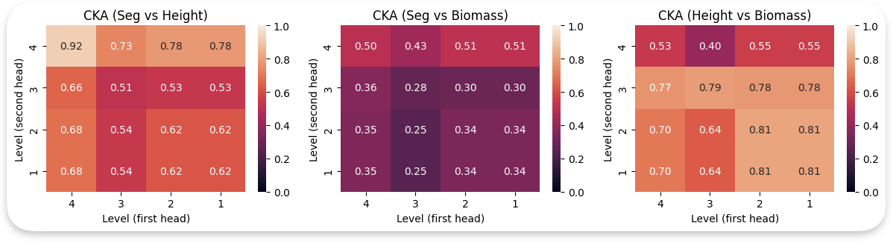
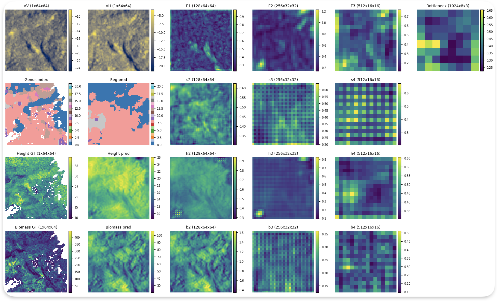

# Model Training & Experiments

Multi-task learning framework for joint prediction of forest genus, canopy height, and biomass from Sentinel-1 SAR imagery.

## Architecture Overview

### U-Net Baseline Models

Three independent U-Net architectures trained separately for each task:

**Encoder:** 4-stage downsampling (64×64 → 32×32 → 16×16 → 8×8 pixels)
- Base channels: 128 → 256 → 512 → 1024
- DoubleConv blocks: 3×3 conv + BatchNorm + ReLU
- Downsampling: Strided 3×3 convolutions (stride=2)

**Decoder:** Symmetric upsampling with skip connections
- Transposed convolutions for upsampling
- Skip connections from encoder preserve spatial detail
- Spatial dropout (p=0.2) before final output

**Task-specific outputs:**
- **Segmentation:** 22-class logits (genus classification)
- **Height regression:** Single-channel continuous map (meters)
- **Biomass regression:** Single-channel continuous map (t/ha)

### Multi-Task U-Net

Shared encoder feeding three task-specific decoder branches:

**Shared encoder:** Same 4-stage architecture as baselines, learns common SAR features useful across all tasks.

**Task-specific decoders:** Independent upsampling paths with separate skip connections
- Segmentation decoder: Higher dropout (p=0.2) for classification complexity
- Regression decoders: Standard dropout (p=0.1)

**Uncertainty-weighted loss:** Automatic task balancing via learned uncertainty. Loss must be normalized before being used in the weighted sum due to magnitude differences between tasks.
```
L_total = Σ_t (1/2σ_t²) L_t + (1/2) log(σ_t²)
```

**Allometric constraint:** Physics-based regularization enforcing height-biomass relationship
```
L_allom = 1/K Σ (log(B) - α - β×log(H))²
```
where α=0.0673, β=2.5 (temperate forest parameters), weight λ=1×10⁻⁴

## Training Configuration

### Hyperparameters

| Parameter | Baseline | Multi-Task |
|-----------|----------|------------|
| Base channels | 128 | 128 |
| Batch size | 8 | 8 |
| Max learning rate | 3×10⁻⁴ | 6×10⁻⁴ |
| Min learning rate | 5×10⁻⁵ | 3×10⁻⁵ |
| Weight decay | 1×10⁻⁴ | 1×10⁻⁴ |
| Optimizer | AdamW | AdamW |
| Scheduler | CosineAnnealing | CosineAnnealing |
| Early stopping | 10 epochs | 10 epochs |
| Max epochs | 100 | 100 |

### Loss Functions

**Segmentation:** Cross-entropy with ignore index for 16 rare genera
```python
L_seg = -1/N Σ log(p_yi)  # Only valid pixels contribute
```

**Regression:** Masked RMSE for height and biomass
```python
L_reg = sqrt(1/M Σ (ŷ - y)²)  # Only finite values
```

## Experimental Results

### Performance Comparison

| Task | Metric | Baseline | Multi-Task | Δ |
|------|--------|----------|------------|---|
| **Genus Segmentation** | Pixel Accuracy | 0.857 | 0.853 | -0.5% |
| | Mean IoU | 0.288 | 0.282 | -2.1% |
| | Mean Dice | 0.366 | 0.366 | 0.0% |
| **Height Regression** | RMSE (m) | 5.243 | 5.209 | -0.7% |
| | R² | 0.255 | 0.265 | **+3.7%** |
| **Biomass Regression** | RMSE (t/ha) | 39.003 | 38.712 | -0.7% |
| | R² | 0.024 | 0.039 | - |

### Per-Genus Segmentation Performance

| Genus | Accuracy | IoU | Dice |
|-------|----------|-----|------|
| Pinus | 0.925 | 0.801 | **0.889** |
| Abies | 0.764 | 0.453 | 0.624 |
| Fagus | 0.554 | 0.341 | 0.518 |
| Fraxinus | 0.931 | 0.029 | 0.057 |
| Picea | 0.835 | 0.032 | 0.063 |
| Quercus | 0.008 | 0.008 | 0.015 |

**Key observations:**
- Pinus achieves highest performance (Dice=0.889) due to distinct SAR signature
- Fagus and Abies show moderate performance despite high abundance
- Quercus severely underperforms, likely due to SAR similarity with other genera

## Prediction Visualizations

### Baseline Model Results

<div style="text-align: center;">


<p style="text-align: center; font-style: italic; margin-top: 5px;">Height scatter plot (left) shows systematic underestimation for tall forests (>30m) and overestimation for short forests (<20m), with predictions clustering around dataset mean. Biomass predictions (right) exhibit severe saturation - model outputs confined to 50-120 t/ha regardless of true values (0-400 t/ha), characteristic of C-band SAR signal saturation beyond ~100 t/ha threshold.</p>
</div>


<p style="text-align: center; font-style: italic; margin-top: 5px;">Example predictions on test samples. Segmentation captures broad patterns but misses fine boundaries. Biomass shows reduced dynamic range. Height preserves spatial structure but underestimates peaks.</p>
</div>

### Multi-Task Model Results

<div style="text-align: center;">

<p style="text-align: center; font-style: italic; margin-top: 5px;">Multi-task predictions show similar patterns to baseline. Height (left) maintains clustering around mean. Biomass (right) still saturates, though slightly improved R² suggests more consistent predictions within observable range.</p>
</div>

<div style="text-align: center;">

<p style="text-align: center; font-style: italic; margin-top: 5px;">Multi-task predictions maintain comparable quality to baselines. Height appears slightly smoother (regularization from shared encoder). Biomass shows marginally improved spatial coherence in transition zones, consistent with allometric constraint.</p>
</div>

## Multi-Task Learning Analysis

### Gradient Alignment

<div style="text-align: center;">

<p style="text-align: center; font-style: italic; margin-top: 5px;">Cosine similarity between task-specific gradients in shared encoder across training epochs.</p>
</div>

**Findings:**
- **Height-biomass pair** shows strongest alignment (0.4-0.9), validating allometric coupling
- **Segmentation-height pair** exhibits moderate positive alignment (0.4-0.7) - both benefit from canopy structure features
- **Segmentation-biomass pair** shows weakest/variable alignment (-0.3 to 0.6) - partially conflicting feature requirements
- All pairs converge to positive alignment in final epochs, indicating successful task balancing

### Feature Similarity (CKA Analysis)


*Centered Kernel Alignment between task-specific decoder representations. Rows=second decoder, columns=first decoder. Layer 4 nearest bottleneck, layer 1 nearest output.*

**Task relationship hierarchy:**

1. **Height-Biomass (strongest):** CKA=0.77-0.81 at deep layers, remains high (0.64-0.81) through shallow layers. Sustained similarity confirms allometric constraint successfully enforces consistent feature learning.

2. **Segmentation-Height (moderate):** CKA>0.7 at layer 4, decreases to 0.51-0.66 at shallow layers. Progressive specialization - both extract canopy structure initially, then diverge for task-specific refinement.

3. **Segmentation-Biomass (weakest):** CKA=0.25-0.51 across all layers. Flat pattern indicates immediate divergence after bottleneck - fundamentally different feature processing requirements.

### Layer-wise Representations


*Feature maps from shared encoder (top) and task-specific decoders (bottom) for a single test sample.*

**Encoder progression:**
- **E1 (128×64×64):** Emphasizes edges and local texture from SAR speckle
- **E2 (256×32×32):** Captures forest stand structure at larger scales
- **E3 (512×16×16):** Coarser spatial organization
- **Bottleneck (1024×8×8):** Compressed representation integrating ~800×800m receptive fields

**Decoder specialization:**
- **Segmentation (s2-s4):** Sharp genus boundaries emerge, recovering fine spatial detail via skip connections
- **Height (h2-h4):** Smooth gradients reflecting continuous nature, extracts volume scattering patterns
- **Biomass (b2-b4):** Distinct spatial organization emphasizing high backscatter regions, but uniform activations reflect saturation problem

**Key insight:** Shared encoder learns structured patterns useful for all tasks. Decoders progressively specialize from shared bottleneck to task-specific outputs, validating architectural design.

## Key Findings

### What Works

✅ **Multi-task learning achieves parity** with single-task baselines while using single shared encoder  
✅ **Uncertainty weighting successfully balances** competing task objectives  
✅ **Allometric constraint couples** height-biomass tasks (high gradient alignment, CKA similarity)  
✅ **Shared encoder learns meaningful features** evidenced by structured representations at all depths  
✅ **Task hierarchy validated:** Height-biomass > Segmentation-height > Segmentation-biomass

### Limitations

⚠️ **C-band SAR saturation** fundamentally limits biomass estimation beyond ~100 t/ha  
⚠️ **Height sensitivity** constrained by C-band wavelength - moderate R² reflects limited information  
⚠️ **Class imbalance** causes poor performance on rare genera (Quercus, Fraxinus, Picea)  
⚠️ **Absolute performance** remains modest despite architectural sophistication

## Scripts & Notebooks

- `jupyter-notebooks/imaestro_baseline.ipynb` for baseline model training
- `jupyter-notebooks/imaestro_mtl_norm-loss.ipynb` for multi-task learning

## Conclusions

This work demonstrates that **physics-aware multi-task learning** provides a viable framework for forest attribute estimation from SAR data. While C-band limitations constrain absolute performance, the approach successfully:

1. Learns shared representations beneficial across multiple tasks
2. Automatically balances competing objectives via uncertainty weighting
3. Incorporates ecological knowledge through allometric regularization
4. Provides interpretable analysis of task relationships and feature learning

The gradient alignment and CKA analyses reveal clear task hierarchies matching ecological expectations, validating the multi-task approach. Future work should focus on overcoming SAR wavelength limitations through L-band integration and multi-modal fusion.
