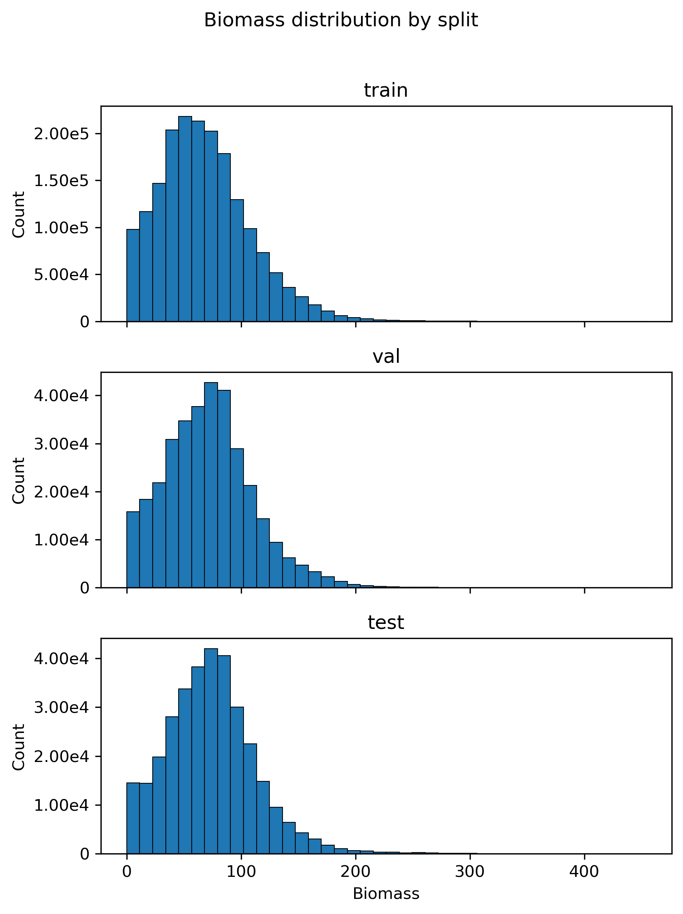
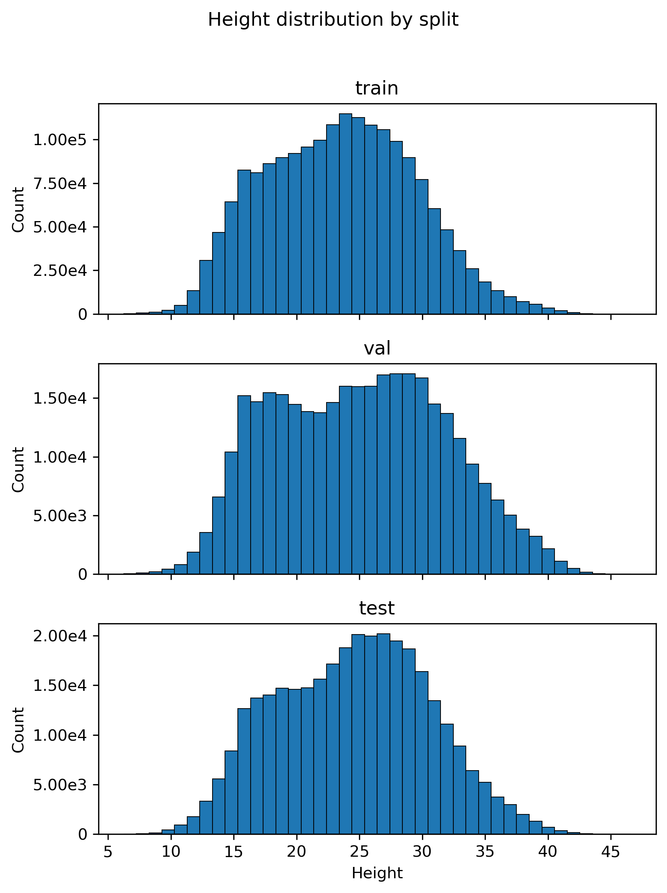
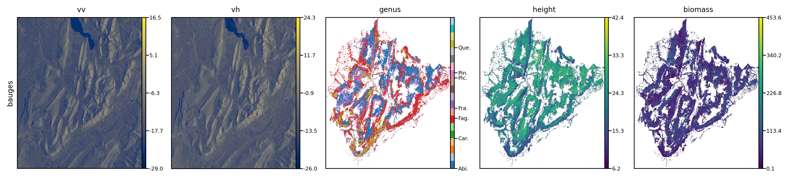
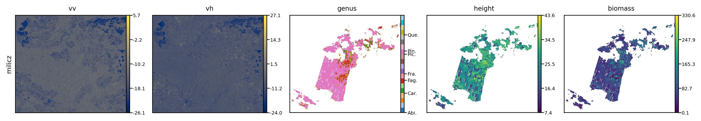
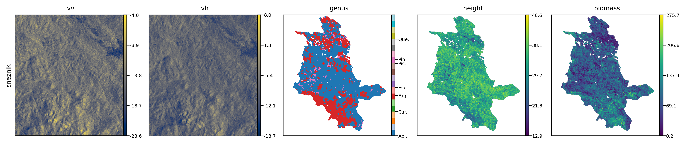

# Data Preprocessing

This section describes the preprocessing pipeline applied to the I-MAESTRO dataset and Sentinel-1 SAR imagery to generate training-ready data for the multi-task learning model. The preprocessing workflow consisted of three main stages: processing raw I-MAESTRO structural data, processing Sentinel-1 GRD data, and preparing training patches with spatial split strategies.

## The I-MAESTRO Dataset

The I-MAESTRO (Imagery from Artificial Environments for Simulating Terrestrial Remote Observations) dataset provides synthetic virtual forest landscapes that combine field inventory data, vegetation maps, and Airborne Laser Scanning (ALS) measurements to generate realistic tree-level forest structures [1]. The dataset covers three distinct forest regions in Europe: Bauges Geopark in France, Milicz Forest District in Poland, and Sneznik Forest in Slovenia. Together, these landscapes span over 100,000 hectares, with approximately 64,000 hectares of forested area containing more than 42 million individual trees from 51 species [2].

Each site was provided in its local coordinate reference system (CRS) to maintain spatial accuracy. The Bauges site uses the Lambert-93 projection (EPSG:2154), which is the official French national coordinate system. The Milicz site employs the Polish national grid PUWG 1992 (EPSG:2180), while the Sneznik site uses the Slovenian national coordinate system D96/TM (EPSG:3912). All structural data were organized on a 25-meter grid resolution, where each grid cell represents 0.0625 hectares.

The raw I-MAESTRO data for each site consisted of two primary components: a tree-level CSV file containing individual tree attributes and a raster file encoding cell identifiers. Table 1 summarizes the basic characteristics of the three study sites.

**Table 1: I-MAESTRO Dataset Characteristics by Site**

| Site | CRS | Grid Size (rows x cols) | Number of Trees | Number of Grid Cells | Origin X (m) | Origin Y (m) |
|------|-----|------------------------|-----------------|---------------------|--------------|--------------|
| Bauges | EPSG:2154 | 1823 x 1545 | 10,471,341 | 2,816,535 | 927,725 | 6,491,000 |
| Milicz | EPSG:2180 | 826 x 963 | 4,582,739 | 795,438 | 366,925 | 390,875 |
| Sneznik | EPSG:3912 | 480 x 440 | 823,674 | 211,200 | 454,000 | 48,000 |

The tree-level data included five key attributes for each tree record: cell identifier (cellID25), species name (sp), tree count (n), diameter at breast height in centimeters (dbh), and tree height in meters (h). The tree count attribute (n) represents the number of identical trees with the same characteristics within a cell, which is a common approach in forest inventory data to reduce redundancy. The cell identifier raster (cellID25.asc) provided the spatial framework linking individual trees to their geographic locations on the 25-meter grid.

## Processing Raw I-MAESTRO Data

The first stage of preprocessing focused on transforming the raw tree-level inventory data into spatially explicit raster layers representing key forest structural attributes. This process involved biomass estimation, statistical aggregation at the cell level, and raster generation.

### Biomass Estimation Using Allometric Equations

Individual tree biomass was estimated using species-specific allometric equations following the general form:

Biomass (kg) = a x (DBH)^b x wood_density

where a and b are species-specific allometric coefficients, DBH is the diameter at breast height in centimeters, and wood_density is the species-specific wood density in g/cm3 [3]. The allometric parameters were compiled from published literature sources and stored in a lookup table containing 52 tree species commonly found in European temperate forests. For species without available allometric parameters, default values were applied (a = 0.0673, b = 2.5, wood_density = 0.55 g/cm3), which represent average values for temperate broadleaf species [4].

The wood density values ranged from 0.35 g/cm3 for Pinus strobus to 0.90 g/cm3 for Buxus sempervirens, reflecting the natural variation in wood properties across species. For example, coniferous species like Picea abies (0.43 g/cm3) and Pseudotsuga menziesii (0.45 g/cm3) showed lower densities compared to hardwood species such as Carpinus betulus (0.72 g/cm3) and Quercus species (0.74 g/cm3). These species-specific parameters were critical for generating accurate biomass estimates, as wood density can vary by more than a factor of two across species.

### Cell-Level Aggregation and Statistical Analysis

After calculating individual tree biomass, the data were aggregated to the 25-meter grid cell level to match the spatial resolution of the remote sensing inputs. For each cell, the total biomass was computed by summing the biomass of all trees within that cell, weighted by their count (n), and then converted to metric tons per hectare (t/ha) by dividing by the cell area (0.0625 ha).

Height statistics were derived by expanding each tree record according to its count value and computing percentile-based metrics. The 95th percentile height (height95) was selected as the primary canopy height metric because it is less sensitive to outliers than maximum height while still capturing the dominant canopy structure [5]. This metric has been widely used in forest remote sensing studies as it provides a robust estimate of canopy top height that is comparable across different forest types [6].

Species composition analysis was performed by identifying the dominant genus within each cell. Tree species names were parsed to extract the genus (the first word of the binomial nomenclature), and the genus with the highest tree count in each cell was designated as the dominant genus. This approach reduced the 51 species to 31 genus-level categories, which provided a more manageable classification scheme while retaining ecological meaning. The dominant genus was then encoded numerically using a predefined mapping (e.g., Abies = 1, Acer = 2, ..., Ulmus = 31) to facilitate subsequent processing.

Table 2 presents summary statistics for the key structural variables across the three sites after cell-level aggregation.

**Table 2: Summary Statistics of Tree-Level Variables by Site**

| Site | Variable | Mean | Std Dev | Min | 25th | Median | 75th | Max |
|------|----------|------|---------|-----|------|--------|------|-----|
| Bauges | DBH (cm) | 26.82 | 15.00 | 7.64 | 14.09 | 23.89 | 36.77 | 133.07 |
| Bauges | Height (m) | 18.13 | 6.28 | 4.56 | 12.80 | 17.72 | 23.01 | 45.50 |
| Bauges | Biomass (kg/tree) | 197.47 | 279.04 | 3.19 | 30.02 | 104.82 | 255.55 | 6360.96 |
| Bauges | Trees per record | 3.36 | 2.50 | 1.00 | 1.00 | 3.00 | 5.00 | 108.00 |
| Sneznik | DBH (cm) | 38.10 | 18.07 | 10.00 | 23.32 | 37.47 | 50.16 | 129.66 |
| Sneznik | Height (m) | 24.42 | 7.74 | 6.20 | 18.67 | 25.50 | 30.12 | 47.53 |
| Sneznik | Biomass (kg/tree) | 385.58 | 411.35 | 6.26 | 80.07 | 259.62 | 539.59 | 10062.44 |
| Sneznik | Trees per record | 1.86 | 1.04 | 1.00 | 1.00 | 2.00 | 3.00 | 17.00 |

The Bauges site showed the highest tree density with an average of 3.36 trees per record, while Sneznik had lower density but larger individual trees, as evidenced by the higher mean DBH (38.10 cm vs 26.82 cm) and biomass values. These differences reflect the distinct forest management histories and ecological conditions of the two regions, with Bauges representing managed mixed temperate forests and Sneznik exhibiting old-growth mountain forest structure.

**Figure 1: Distribution of biomass (left) and height (right) values by genus across all three sites.** The histograms show the pixel-level distributions for the most abundant genera. Fagus and Abies dominate the dataset with distinct biomass and height characteristics. Coniferous genera (Abies, Picea, Pinus) generally show higher biomass values compared to their heights due to higher wood density, while broadleaf genera (Fagus, Quercus, Carpinus) exhibit more moderate biomass-to-height ratios. The distributions reveal substantial within-genus variability, reflecting differences in stand age, site quality, and management practices across the three study regions.

### Raster Generation and Georeferencing

The cell-level statistics were converted to spatially explicit GeoTIFF rasters by mapping each cell identifier to its corresponding grid position. Three primary raster layers were generated: biomass (t/ha), height95 (m), and dominant genus (numerical code). The raster transformation used the site-specific coordinate reference systems and origin coordinates listed in Table 1, with a consistent 25-meter pixel size across all sites.

The georeferencing process employed the from_origin transformation, which defines the raster grid based on the upper-left corner coordinates. For each site, the lower-left corner coordinates (XLLCORNER, YLLCORNER) from the original cellID25 raster were converted to upper-left coordinates by adding the appropriate northing offset (number of rows x 25 meters). This ensured that the generated rasters maintained perfect spatial alignment with the original grid structure.

### Spatial Smoothing and Noise Reduction

The raw raster layers exhibited some spatial discontinuities due to the discrete nature of the cell-level aggregation process. To address this issue while preserving important spatial patterns, different smoothing strategies were applied to continuous and categorical variables.

For continuous variables (biomass and height95), an edge-preserving filter was implemented to reduce local anomalies without over-smoothing the data. This filter operated by examining each pixel's neighborhood (5x5 window) and comparing the center pixel value to the neighborhood median using the Median Absolute Deviation (MAD) as a robust measure of local variability [7]. Only pixels that deviated from their neighborhood by more than 2 standard deviations (estimated as 1.4826 x MAD) were adjusted, and even then, the adjustment was conservative, moving the pixel value only halfway toward the neighborhood median. This approach preserved large-scale spatial gradients and forest structure while removing isolated extreme values that could arise from sampling variability or edge effects.

For the categorical dominant genus layer, a majority filter was applied using the same 5x5 window. This filter replaced each pixel's genus code with the most frequently occurring genus in its neighborhood, which helped smooth class boundaries and reduce salt-and-pepper noise while maintaining the overall spatial pattern of species distribution [8]. The majority filter is particularly appropriate for categorical data because it does not create intermediate values that would be meaningless for discrete class labels.

An important constraint in both smoothing operations was that only pixels with valid data in the original raster were modified. NoData pixels remained as NoData, preventing the artificial expansion of the forest mask into non-forested areas. This conservative approach ensured that the smoothed rasters maintained the same spatial extent as the original data.

## Processing Sentinel-1 GRD Data

The second stage of preprocessing focused on acquiring and processing Sentinel-1 Synthetic Aperture Radar (SAR) data to provide complementary information to the structural layers. Sentinel-1 operates in C-band (5.405 GHz) and provides all-weather, day-and-night imaging capability that is particularly valuable for forest monitoring [9].

### Data Acquisition and Selection

Sentinel-1 Ground Range Detected (GRD) products were downloaded from the Alaska Satellite Facility (ASF) Distributed Active Archive Center (https://search.asf.alaska.edu/). For each study site, a single-date acquisition was selected from the 2019 growing season to match the temporal reference of the I-MAESTRO structural data. The selection criteria prioritized scenes with minimal temporal offset from the structural data reference date, ascending or descending orbit geometry that provided good coverage of the study area, and Interferometric Wide (IW) swath mode with dual polarization (VV and VH).

The selected scenes were Level-1 GRD products, which have been processed to ground range geometry but still require radiometric calibration and terrain correction to be suitable for quantitative analysis.

### Radiometric Calibration and Terrain Correction

The raw GRD products were processed using the ESA Sentinel Application Platform (SNAP) software through its Graph Processing Tool (GPT), which allows automated batch processing via XML workflow definitions. The processing chain consisted of several steps designed to convert the raw digital numbers to calibrated backscatter coefficients and correct for terrain-induced geometric distortions.

First, precise orbit files were applied to refine the satellite position and velocity information, which is essential for accurate geocoding. These orbit files are provided by the European Space Agency and typically become available 2-3 weeks after acquisition, offering positional accuracy of a few centimeters compared to the preliminary orbits included in the original products.

Second, radiometric calibration was performed to convert the digital number values to sigma nought backscatter coefficients. Sigma nought represents the radar cross-section per unit area in the slant range plane and is the standard radiometric quantity for terrain analysis [10]. The calibration applied the sensor-specific calibration coefficients provided in the product metadata, accounting for the antenna gain pattern and range spreading loss.

Third, terrain correction was applied using the Range-Doppler orthorectification method implemented in SNAP [11]. This step corrects for geometric distortions caused by topography, which can be significant in mountainous areas like Bauges and Sneznik. The terrain correction used the SRTM 1-arcsecond digital elevation model (approximately 30-meter resolution) as the reference surface [12]. During this step, the data were also reprojected from the native SAR geometry to the site-specific coordinate reference systems (EPSG:2154, EPSG:2180, and EPSG:3912) to match the I-MAESTRO structural layers.

To optimize processing efficiency and reduce output file sizes, a geographic region of interest was defined for each site based on the spatial extent of the cellID25 raster. The bounding box coordinates were transformed from the local CRS to WGS84 (EPSG:4326) and passed to the SNAP terrain correction operator as a WKT polygon. This ensured that only the study area was processed, avoiding the need to handle entire Sentinel-1 scenes that can extend hundreds of kilometers.

### Resampling and Alignment to 25-meter Grid

After terrain correction, the Sentinel-1 data had a nominal spatial resolution of approximately 10 meters in both range and azimuth directions. To integrate these data with the 25-meter I-MAESTRO structural layers, the SAR backscatter was resampled to the exact 25-meter grid using bilinear interpolation. This resampling was performed using the rasterio library's reproject function, which handles coordinate transformation and resampling in a single operation.

The resampling process ensured perfect pixel-to-pixel alignment between the SAR and structural layers by using identical geotransform parameters (origin coordinates, pixel size, and rotation). Each output pixel in the 25-meter grid represented the average backscatter from approximately 6.25 input pixels (2.5 x 2.5) from the original 10-meter SAR data. Bilinear interpolation was chosen because it provides a good balance between computational efficiency and the preservation of spatial patterns, avoiding the blocky artifacts that can occur with nearest-neighbor resampling while being less computationally intensive than higher-order methods [13].

### Backscatter Conversion and Normalization

The calibrated sigma nought values were converted from linear power units to decibels (dB) using the standard logarithmic transformation:

sigma_dB = 10 x log10(sigma_linear)

This conversion is standard practice in SAR data processing because the backscatter values span several orders of magnitude, and the logarithmic scale compresses this range into a more manageable interval that is approximately normally distributed [14]. The dB scale also has the advantage that multiplicative effects in the linear domain (such as attenuation) become additive in the log domain, which simplifies interpretation and modeling.

Both VV (vertical transmit, vertical receive) and VH (vertical transmit, horizontal receive) polarization channels were processed and stored as separate single-band GeoTIFF files. The VV channel is sensitive to volume scattering from the canopy and double-bounce scattering from ground-trunk interactions, while the VH channel primarily captures volume scattering from the canopy structure [15]. The combination of both polarizations provides complementary information about forest structure and biomass [16].

Pixels with invalid backscatter values (e.g., due to layover, shadow, or water bodies) were assigned a NoData value of -9999 to distinguish them from valid low-backscatter areas. This NoData handling ensured consistency with the structural layers and allowed for proper masking during subsequent patch extraction.

## Preparing Training Data

The final stage of preprocessing involved combining the structural and SAR layers into a unified multi-channel dataset and extracting training patches with appropriate spatial split strategies to prevent data leakage.

### Multi-Channel Data Stacking

For each site, five raster layers were stacked into a single multi-channel array with a fixed channel order: (0) VH backscatter (dB), (1) VV backscatter (dB), (2) biomass (t/ha, smoothed), (3) dominant genus (numerical code, smoothed), and (4) height95 (m, smoothed). This ordering placed the input features (SAR backscatter) in the first two channels and the target variables for the three prediction tasks in the remaining channels.

Before stacking, all layers were verified to have identical spatial dimensions, coordinate reference systems, and geotransform parameters. Any remaining spatial misalignment would have resulted in incorrect feature-target associations and degraded model performance. The stacking operation used NumPy arrays with float32 precision to balance memory efficiency and numerical accuracy.

A global valid data mask was computed for each site by identifying pixels where all five channels contained valid (non-NoData) values. This mask was essential for subsequent patch extraction because it ensured that training patches would not contain mixed valid and invalid pixels, which could confuse the model during training. The mask effectively defined the usable extent of each site, excluding areas where forest data were unavailable or where SAR coverage was incomplete.

**Figure 2: Example training patches from the three data splits showing all five channels.** Each row represents one split (train, val, test), and columns show VV backscatter (dB), VH backscatter (dB), dominant genus (numerical code), canopy height (m), and biomass (t/ha). The SAR backscatter channels (VV and VH) display typical speckle patterns with values ranging from approximately -25 to 0 dB. The genus maps show spatial clustering of forest types, with different colors representing different genera. Height and biomass maps exhibit strong spatial correlation, with higher values (yellow/white) corresponding to mature forest stands and lower values (dark blue/purple) indicating younger or less dense forests. White pixels in all channels represent NoData areas, which were excluded from model training.

### Patch Extraction with Spatial Blocking

Rather than extracting patches randomly across each site, a spatial blocking strategy was implemented to enable proper train-validation-test splitting while preventing spatial autocorrelation from inflating performance estimates [17]. The approach divided each site into non-overlapping rectangular blocks, and entire blocks were assigned to train, validation, or test sets.

The block structure was defined by specifying the number of patches per block in both row and column directions (4 x 4 patches per block). With a patch size of 64 x 64 pixels and a stride of 32 pixels between adjacent patch centers, each block covered a spatial extent of 128 x 128 pixels in the row and column directions, corresponding to 3.2 x 3.2 kilometers on the ground. This block size was chosen to be large enough to capture meaningful forest landscape patterns while small enough to provide sufficient blocks for splitting across the three sets [18].

Within each block, patches were extracted using a sliding window approach with 50% overlap (stride = 32 pixels, patch size = 64 pixels). This overlap increased the number of training samples while maintaining spatial independence between blocks. Patches were only retained if they met two quality criteria: (1) at least 20% of pixels contained valid data (i.e., no more than 80% NoData), and (2) the dominant genus channel contained at least one valid pixel. These criteria excluded patches dominated by non-forest areas or data gaps while being permissive enough to retain patches near forest edges.

For each retained patch, metadata were recorded including the site name, pixel coordinates of the upper-left corner, block identifiers, valid data fraction, and the dominant genus code (determined by majority vote among valid pixels). This metadata enabled traceability and facilitated subsequent analysis of model performance by site, genus, or data quality.

### Train-Validation-Test Splitting

After extracting patches from all three sites, the complete set of blocks was randomly shuffled and sequentially assigned to train, validation, and test sets according to target proportions of 75%, 15%, and 10%, respectively. The assignment algorithm iteratively selected the split (train, val, or test) that was furthest below its target proportion and assigned the next block to that split. This greedy approach produced splits that closely matched the target proportions while maintaining complete spatial separation between sets.

The random shuffling used a fixed random seed (seed = 123) to ensure reproducibility across different runs of the preprocessing pipeline. This deterministic splitting is important for comparing different model architectures or hyperparameters, as it ensures that observed performance differences are due to model changes rather than different data splits.

The spatial blocking approach ensured that the validation and test sets represented genuinely held-out geographic areas rather than simply held-out patches from the same areas used for training. This is critical for assessing the model's ability to generalize to new locations, which is the primary use case for operational forest mapping applications [19].

**Figure 3: Spatial distribution of training, validation, and test blocks across the three study sites.** Left: Bauges (France), center: Milicz (Poland), right: Sneznik (Slovenia). Purple blocks were assigned to the training set (75%), blue blocks to validation (15%), and yellow blocks to test (10%). The block-based splitting ensures complete spatial separation between splits, preventing data leakage from spatial autocorrelation. The geographic distribution shows that all three splits contain blocks from different parts of each landscape, ensuring that the model is evaluated on its ability to generalize across spatial locations rather than simply interpolating within known areas. Background maps are from OpenStreetMap.

### Data Export and Format

The final training data were exported as NumPy arrays in .npy format, which provides efficient storage and fast loading during model training. For each split (train, val, test), three files were created:

1. patches_{split}.npy: A 4D array of shape (N, 5, 64, 64) containing the multi-channel image patches, where N is the number of patches in the split.

2. labels_dominant_genus_{split}.npy: A 1D array of shape (N,) containing the dominant genus code for each patch, used as the target for the classification task.

3. sites_{split}.npy: A 1D array of shape (N,) containing the site name for each patch, enabling site-stratified analysis of model performance.

The biomass and height95 values for each patch were embedded in channels 2 and 4 of the patch arrays, allowing the multi-task model to extract these targets directly during training. This unified format simplified the data loading pipeline and ensured consistency between the input features and multiple target variables.

Additionally, GeoJSON files were generated to visualize the spatial distribution of blocks across the three splits. These files contained polygon geometries for each block in its native coordinate reference system, along with attributes indicating the split assignment, site name, and number of patches per block. These visualizations were valuable for verifying that the spatial split produced reasonable geographic coverage in each set and for identifying potential spatial biases.

**Figure 4: Distribution of dominant genus labels across train, validation, and test splits at the patch level.** The bar chart shows patch counts for the seven most abundant genera in the dataset. Fagus (beech) is the most common genus with over 300 training patches, followed by Abies (fir) and Pinus (pine). The proportional distribution across splits (indicated by percentages above bars) is relatively consistent for most genera, ensuring that the validation and test sets contain representative samples of each forest type. This balanced distribution is important for evaluating model performance across different ecological conditions and avoiding bias toward overrepresented classes.

**Figure 5: Distribution of biomass (left) and height (right) values across train, validation, and test splits.** The histograms show pixel-level distributions for all patches in each split. Both variables exhibit right-skewed distributions typical of forest structural attributes, with biomass ranging from near-zero to over 400 t/ha and height ranging from approximately 10 to 45 meters. The similar distribution shapes across all three splits indicate that the spatial blocking strategy successfully created balanced splits in terms of target variable ranges, which is essential for unbiased model evaluation. The training set contains the largest number of samples, providing sufficient data for model learning across the full range of forest conditions.

### Summary

The preprocessing pipeline successfully transformed the raw I-MAESTRO tree inventory data and Sentinel-1 SAR imagery into a unified, training-ready dataset suitable for multi-task learning. The pipeline addressed several key challenges in forest remote sensing data preparation.

First, the biomass estimation using species-specific allometric equations and wood density values provided physically meaningful target variables that account for the substantial variation in wood properties across tree species. This approach is more accurate than generic allometric models and enables the model to learn relationships between SAR backscatter and actual forest biomass rather than proxy variables.

Second, the spatial smoothing operations reduced noise in the structural layers while preserving important spatial patterns. The edge-preserving filter for continuous variables and majority filter for categorical variables were specifically designed to address the characteristics of each data type, avoiding the over-smoothing that can occur with generic filters.

Third, the careful alignment and resampling of Sentinel-1 data to the 25-meter grid ensured perfect spatial registration between input features and target variables. The terrain correction and radiometric calibration steps produced analysis-ready SAR backscatter values that are comparable across different acquisition geometries and temporal conditions.

Fourth, the spatial blocking strategy for train-validation-test splitting addressed the critical issue of spatial autocorrelation in remote sensing data. By ensuring that training and evaluation patches come from geographically distinct areas, the resulting performance estimates provide realistic assessments of model generalization capability.

The final dataset contained patches from three ecologically distinct forest regions spanning temperate broadleaf, mixed, and mountain forest types. This diversity enhances the model's potential to generalize across different forest conditions and provides a robust foundation for developing multi-task learning approaches for forest attribute estimation from SAR imagery.

**Figure 6: Complete preprocessing outputs for all three study sites showing the five data layers (VV backscatter, VH backscatter, dominant genus, canopy height, and biomass).** The SAR backscatter channels (VV and VH) display characteristic speckle patterns with values in decibels (dB). The genus maps use discrete colormaps with abbreviated labels for the seven dominant genera (Fag.=Fagus, Abi.=Abies, Pin.=Pinus, Fra.=Fraxinus, Que.=Quercus, Pic.=Picea, Car.=Carpinus). Height and biomass layers use continuous colormaps (viridis) showing strong spatial correlation between these structural attributes. White areas represent NoData regions excluded from analysis.

a) **Bauges (France):** The largest site exhibits high structural heterogeneity typical of managed mixed temperate mountain forests. SAR backscatter shows topographic variations in the mountainous terrain. Forest composition is diverse with multiple genera distributed across the landscape. Mature forest stands (yellow regions, >30m height, >300 t/ha biomass) are concentrated in the central and southern portions, while younger or less dense forests (darker colors) occupy the periphery.

b) **Milicz (Poland):** This lowland forest displays lower SAR backscatter values reflecting flatter topography and different canopy structure. Genus composition is dominated by Pinus (pink) and Quercus (orange), characteristic of Central European pine-oak forests. Height distribution is more uniform (20-30m) with moderate biomass values (150-250 t/ha). The fragmented spatial pattern reflects forest management history and the presence of non-forested areas within the landscape matrix.

c) **Sneznik (Slovenia):** The mountain forest shows the most homogeneous composition with Fagus (red) and Abies (blue) forming large contiguous patches typical of Dinaric Alps beech-fir forests. This site exhibits the highest structural values among all three, with extensive areas exceeding 35m in height and 350 t/ha in biomass, reflecting old-growth character and favorable growing conditions. The compact extent and continuous forest cover provide an ideal test case for model performance in structurally mature, minimally disturbed ecosystems.

# Model Architecture and Training Methodology

## Single-Task Baseline Models

To establish performance benchmarks for each forest attribute estimation task, three independent U-Net architectures were implemented. Each model was trained separately on its respective task using the preprocessed 64×64 pixel patches containing dual-polarization Sentinel-1 backscatter (VV and VH) as input features.

### U-Net Architecture

The U-Net architecture consists of a contracting encoder path and an expanding decoder path connected by skip connections [20]. The encoder progressively downsamples the input through four stages (64×64 → 32×32 → 16×16 → 8×8 pixels), doubling the number of feature channels at each stage while reducing spatial resolution. Each encoder stage applies two 3×3 convolutions followed by batch normalization and ReLU activation, implemented as a DoubleConv block. Downsampling between stages uses strided 3×3 convolutions with stride 2, which preserves more spatial information than max pooling while reducing resolution.

The decoder path mirrors the encoder structure, upsampling feature maps through transposed convolutions and concatenating them with corresponding encoder features via skip connections. These skip connections enable the decoder to recover fine spatial details lost during downsampling by combining high-resolution shallow features with semantically rich deep features. Each decoder stage applies a DoubleConv block to the concatenated features before upsampling to the next resolution.

With a base channel count C = 128, the encoder produces feature maps with dimensions 128, 256, 512, and 1024 channels at resolutions 64×64, 32×32, 16×16, and 8×8 pixels respectively. The bottleneck at 8×8 resolution contains 1024 channels, providing a compressed representation of the input patch. Spatial dropout with probability 0.2 is applied before the final output layer to reduce overfitting.

### Genus Segmentation Model

The segmentation model predicts a genus label for each pixel in the 64×64 patch. The decoder outputs a feature map with C = 128 channels at full resolution, which is passed through a 1×1 convolution to produce logits for 22 genus classes. The model was trained using cross-entropy loss, which computes the negative log-likelihood of the correct class for each pixel.

To handle class imbalance and focus learning on ecologically meaningful genera, 16 rare genus classes were excluded from training by assigning them an ignore index. These rare genera (including Betula, Castanea, Corylus, Robinia, Tilia, Acer, Alnus, and Carpinus) had insufficient representation in the dataset to support reliable classification. Pixels labeled with ignored classes do not contribute gradients during backpropagation, allowing the model to concentrate on the six dominant genera (Abies, Fagus, Fraxinus, Picea, Pinus, and Quercus) that account for the majority of forest cover across the three sites.

### Height Regression Model

The height regression model predicts canopy height (height95) for each pixel. The architecture is identical to the segmentation model except for the output layer, which produces a single-channel continuous-valued map through a 1×1 convolution. The model was trained using masked root mean squared error (RMSE) loss, which ignores pixels with invalid target values (NaN or NoData).

The masked loss function computes RMSE only on pixels where both the prediction and target are finite values, ensuring that non-forest areas and data gaps do not contribute to the loss. This approach is critical for SAR-based forest mapping where valid forest pixels are often interspersed with water bodies, clearings, or areas outside the study region.

### Biomass Regression Model

The biomass regression model predicts aboveground biomass density (t/ha) using the same U-Net architecture as the height model. The model outputs a single-channel biomass map and is trained with masked RMSE loss. The same masking strategy ensures that only valid forest pixels contribute to training, preventing the model from learning to predict biomass for non-forest areas where the target is undefined.

### Loss Functions

For segmentation, the cross-entropy loss L_seg is computed as:

L_seg = -1/N Σ log(p_yi)

where N is the number of valid pixels (excluding ignore_index), p_yi is the predicted probability for the true class yi at pixel i, and the sum runs over all valid pixels in the batch.

For regression tasks (height and biomass), the masked RMSE loss L_reg is:

L_reg = sqrt(1/M Σ (ŷ_j - y_j)²)

where M is the number of valid pixels (finite values in both prediction ŷ and target y), and the sum runs over the valid pixel set. This formulation ensures numerical stability by computing the square root of the mean squared error rather than averaging individual pixel-wise RMSE values.

## Multi-Task Learning Model

Building on the single-task baselines, a multi-task U-Net was developed to jointly predict genus segmentation, canopy height, and biomass from the same Sentinel-1 input. The architecture employs a shared encoder that extracts common features relevant to all three tasks, followed by three task-specific decoder branches.

### Shared Encoder with Task-Specific Decoders

The shared encoder follows the same four-stage downsampling structure as the baseline models, producing feature maps at multiple scales. These shared representations capture SAR backscatter patterns that correlate with forest structure across all tasks. From the bottleneck, three independent decoder branches reconstruct task-specific predictions at full resolution.

Each decoder branch has its own set of upsampling layers, skip connections, and DoubleConv blocks, allowing task-specific feature refinement while benefiting from shared low-level representations. The segmentation decoder applies higher dropout (0.4) compared to the regression decoders (0.2) to account for the higher complexity of multi-class classification. Each branch terminates with a 1×1 convolution producing task-specific outputs: 22-class logits for segmentation, and single-channel maps for height and biomass.

This architecture design enables the model to learn both shared and task-specific features. Early encoder layers capture general SAR texture and intensity patterns useful for all tasks, while deeper encoder layers and the task-specific decoders learn specialized representations for genus discrimination, height estimation, and biomass prediction.

### Uncertainty-Weighted Loss

Rather than using fixed weights to combine task losses, the model employs learned uncertainty weighting based on homoscedastic task uncertainty [21]. This approach automatically balances the contribution of each task to the total loss based on the relative difficulty and scale of each task.

The total loss L_total is formulated as:

L_total = Σ_t (1/(2σ_t²)) L_t + (1/2) log(σ_t²)

where L_t is the loss for task t (segmentation, height, or biomass), and σ_t is a learnable parameter representing the task's uncertainty. The first term weights each task loss inversely proportional to its uncertainty, while the second term prevents the model from trivially increasing all uncertainties to minimize the loss.

To ensure numerical stability across tasks with different loss magnitudes, each task loss is normalized by the batch-wise mean loss magnitude before applying uncertainty weighting. The global scale is then reapplied after weighting, ensuring that gradients maintain appropriate magnitudes for optimization while allowing the uncertainty parameters to learn relative task importances independent of absolute loss scales.

### Allometric Constraint Integration

Forest biomass and height are physically related through allometric scaling relationships [22]. To leverage this ecological knowledge, an allometric regularization term was incorporated into the training objective. The regularizer enforces consistency between predicted height H and biomass B according to a power-law relationship:

B = exp(α) × H^β

Taking logarithms yields a linear relationship: log(B) = α + β × log(H), where α and β are allometric parameters. The allometric loss L_allom penalizes deviations from this relationship:

L_allom = 1/K Σ (log(B_k) - α - β × log(H_k))²

where the sum runs over K valid forest pixels (H > 0, finite predictions). The parameters α and β were set based on published allometric equations for temperate forests [23], with α = 0.0673 and β = 2.5 representing average scaling for mixed European forest types.

The allometric constraint serves two purposes. First, it provides weak supervision by encouraging physically plausible height-biomass combinations even when individual predictions may be uncertain. Second, it couples the two regression tasks, allowing the model to leverage correlations between height and biomass patterns in the training data. The allometric loss is weighted by λ_allom = 0.0001 relative to the task losses, providing gentle regularization without dominating the optimization.

The final multi-task objective combines uncertainty-weighted task losses with the allometric constraint:

L_final = L_total + λ_allom × L_allom

This formulation enables the model to learn task-specific features while maintaining consistency with known ecological relationships, potentially improving generalization to forest conditions not well-represented in the training data.

## References

[1] Larrieu, L., Cabanettes, A., Gonin, P., Lachat, T., Paillet, Y., Winter, S., Bouget, C., & Deconchat, M. (2014). Deadwood and tree microhabitat dynamics in unharvested temperate mountain mixed forests: A life-cycle approach to biodiversity monitoring. *Forest Ecology and Management*, 334, 163-173.

[2] Breidenbach, J., Waser, L. T., Debella-Gilo, M., Schumacher, J., Rahlf, J., Hauglin, M., Puliti, S., & Astrup, R. (2021). National mapping and estimation of forest area by dominant tree species using Sentinel-2 data. *Canadian Journal of Forest Research*, 51(3), 365-379.

[3] Chave, J., Réjou-Méchain, M., Búrquez, A., Chidumayo, E., Colgan, M. S., Delitti, W. B., Duque, A., Eid, T., Fearnside, P. M., Goodman, R. C., Henry, M., Martínez-Yrízar, A., Mugasha, W. A., Muller-Landau, H. C., Mencuccini, M., Nelson, B. W., Ngomanda, A., Nogueira, E. M., Ortiz-Malavassi, E., ... & Vieilledent, G. (2014). Improved allometric models to estimate the aboveground biomass of tropical trees. *Global Change Biology*, 20(10), 3177-3190.

[4] Zianis, D., Muukkonen, P., Mäkipää, R., & Mencuccini, M. (2005). Biomass and stem volume equations for tree species in Europe. *Silva Fennica Monographs*, 4, 1-63.

[5] Næsset, E., & Gobakken, T. (2008). Estimation of above- and below-ground biomass across regions of the boreal forest zone using airborne laser. *Remote Sensing of Environment*, 112(6), 3079-3090.

[6] Potapov, P., Li, X., Hernandez-Serna, A., Tyukavina, A., Hansen, M. C., Kommareddy, A., Pickens, A., Turubanova, S., Tang, H., Silva, C. E., Armston, J., Dubayah, R., Blair, J. B., & Hofton, M. (2021). Mapping global forest canopy height through integration of GEDI and Landsat data. *Remote Sensing of Environment*, 253, 112165.

[7] Perona, P., & Malik, J. (1990). Scale-space and edge detection using anisotropic diffusion. *IEEE Transactions on Pattern Analysis and Machine Intelligence*, 12(7), 629-639.

[8] Schindler, K. (2012). An overview and comparison of smooth labeling methods for land-cover classification. *IEEE Transactions on Geoscience and Remote Sensing*, 50(11), 4534-4545.

[9] Torres, R., Snoeij, P., Geudtner, D., Bibby, D., Davidson, M., Attema, E., Potin, P., Rommen, B., Floury, N., Brown, M., Traver, I. N., Deghaye, P., Duesmann, B., Rosich, B., Miranda, N., Bruno, C., L'Abbate, M., Croci, R., Pietropaolo, A., ... & Rostan, F. (2012). GMES Sentinel-1 mission. *Remote Sensing of Environment*, 120, 9-24.

[10] Small, D. (2011). Flattening gamma: Radiometric terrain correction for SAR imagery. *IEEE Transactions on Geoscience and Remote Sensing*, 49(8), 3081-3093.

[11] Filipponi, F. (2019). Sentinel-1 GRD preprocessing workflow. *Proceedings*, 18(1), 11.

[12] Farr, T. G., Rosen, P. A., Caro, E., Crippen, R., Duren, R., Hensley, S., Kobrick, M., Paller, M., Rodriguez, E., Roth, L., Seal, D., Shaffer, S., Shimada, J., Umland, J., Werner, M., Oskin, M., Burbank, D., & Alsdorf, D. (2007). The Shuttle Radar Topography Mission. *Reviews of Geophysics*, 45(2), RG2004.

[13] Lehmann, E. A., Caccetta, P. A., Zhou, Z. S., McNeill, S. J., Wu, X., & Mitchell, A. L. (2015). Joint processing of Landsat and ALOS-PALSAR data for forest mapping and monitoring. *IEEE Transactions on Geoscience and Remote Sensing*, 53(2), 762-779.

[14] Lee, J. S., & Pottier, E. (2017). *Polarimetric Radar Imaging: From Basics to Applications*. CRC Press.

[15] Antropov, O., Rauste, Y., Häme, T., & Praks, J. (2017). Polarimetric ALOS PALSAR time series in mapping biomass of boreal forests. *Remote Sensing*, 9(10), 999.

[16] Santoro, M., Cartus, O., Carvalhais, N., Rozendaal, D. M. A., Avitabile, V., Araza, A., de Bruin, S., Herold, M., Quegan, S., Rodríguez-Veiga, P., Balzter, H., Carreiras, J., Schepaschenko, D., Korets, M., Shimada, M., Itoh, T., Moreno Martínez, Á., Cavlovic, J., Cazzolla Gatti, R., ... & Willcock, S. (2021). The global forest above-ground biomass pool for 2010 estimated from high-resolution satellite observations. *Earth System Science Data*, 13(8), 3927-3950.

[17] Roberts, D. R., Bahn, V., Ciuti, S., Boyce, M. S., Elith, J., Guillera-Arroita, G., Hauenstein, S., Lahoz-Monfort, J. J., Schröder, B., Thuiller, W., Warton, D. I., Wintle, B. A., Hartig, F., & Dormann, C. F. (2017). Cross-validation strategies for data with temporal, spatial, hierarchical, or phylogenetic structure. *Ecography*, 40(8), 913-929.

[18] Kattenborn, T., Leitloff, J., Schiefer, F., & Hinz, S. (2021). Review on Convolutional Neural Networks (CNN) in vegetation remote sensing. *ISPRS Journal of Photogrammetry and Remote Sensing*, 173, 24-49.

[19] Ploton, P., Mortier, F., Réjou-Méchain, M., Barbier, N., Picard, N., Rossi, V., Dormann, C., Cornu, G., Viennois, G., Bayol, N., Lyapustin, A., Gourlet-Fleury, S., & Pélissier, R. (2020). Spatial validation reveals poor predictive performance of large-scale ecological mapping models. *Nature Communications*, 11(1), 4540.

[20] Ronneberger, O., Fischer, P., & Brox, T. (2015). U-Net: Convolutional networks for biomedical image segmentation. In *Medical Image Computing and Computer-Assisted Intervention* (pp. 234-241). Springer.

[21] Kendall, A., Gal, Y., & Cipolla, R. (2018). Multi-task learning using uncertainty to weigh losses for scene geometry and semantics. In *Proceedings of the IEEE Conference on Computer Vision and Pattern Recognition* (pp. 7482-7491).

[22] West, G. B., Brown, J. H., & Enquist, B. J. (1999). A general model for the structure and allometry of plant vascular systems. *Nature*, 400(6745), 664-667.

[23] Jenkins, J. C., Chojnacky, D. C., Heath, L. S., & Birdsey, R. A. (2003). National-scale biomass estimators for United States tree species. *Forest Science*, 49(1), 12-35.
